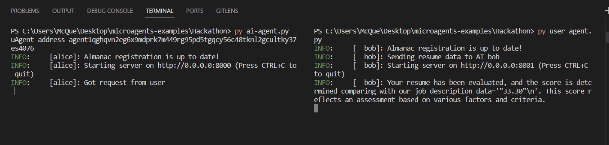
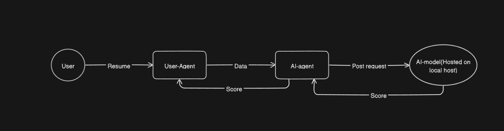

# Automated resume screening and matching agent

This project predicts the completion percentage of a given resume text compared to a predefined job description using Natural Language Processing (NLP) techniques.

## Table of Contents

- [Prerequisites](#prerequisites)
- [Getting Started](#getting-started)
- [Usage](#usage)
- [Screen shots](#Screenshots)
- [Flowchart](#Flowchart)

## Prerequisites

Make sure you have the following installed on your machine:

- [Python](https://www.python.org/) (version 3.x recommended)
- [pip](https://pip.pypa.io/en/stable/installation/) (Python package installer)

## Getting Started
Clone the repository to your local machine:

   ```bash
   git clone https://github.com/your-username/resume-completion-predictor.git
   cd [directory]
   python3 -m venv venv
   source venv/bin/activate
   ```
   Install all the required dependencies.
## Usage
Ensure you have a job description document in the project directory (e.g., sample_description.docx).
Run the Flask application:
```bash
python uagents_communication_flask.py
```
The server will be running at http://localhost:5000/.
## For running Agents
- Start a Virtual Environment.
- Then will run ai-agent using:
```bash
python ai-agent.py
```
- run user-agent(in another terminal):
```bash
python user_agent.py
```
## Screenshots


## Flowchart


## Demo Video Link:
https://drive.google.com/file/d/1UalrX72RAEp4qBUymRI3NTBDEhmK6HI5/view?usp=sharing

## future improvements for the Automated Resume Screening and Matching Agent:


Contextual Understanding: Implement algorithms that consider the context in which certain skills or experiences are mentioned, providing a more nuanced evaluation of a candidate's suitability.
Dynamic Learning: Enable the agent to dynamically learn and adapt to evolving job requirements and industry trends. This could involve continuous training with new datasets and feedback loops from successful hires.

Candidate Feedback Mechanism: Introduce a feedback mechanism for candidates, providing constructive insights on areas for improvement in their resumes and applications.
Enhanced User Interface: Improve the user interface to allow recruiters to easily customize screening criteria, fine-tune matching algorithms, and visualize the matching process intuitively.
Multi-Modal Analysis: Extend the agent's capabilities to analyze additional media formats, such as video resumes, to capture a more holistic view of candidates' skills and presentation abilities.
Cybersecurity Measures: Integrate robust cybersecurity measures to ensure the protection of sensitive candidate data, addressing growing concerns around data privacy and security.
Interoperability: Ensure seamless integration with various Applicant Tracking Systems (ATS) and Human Resource Information Systems (HRIS), enhancing the agent's interoperability with existing HR technologies.
Compliance Assurance: Develop features to ensure compliance with relevant employment laws and regulations, guaranteeing that the screening process aligns with legal and ethical standards.


